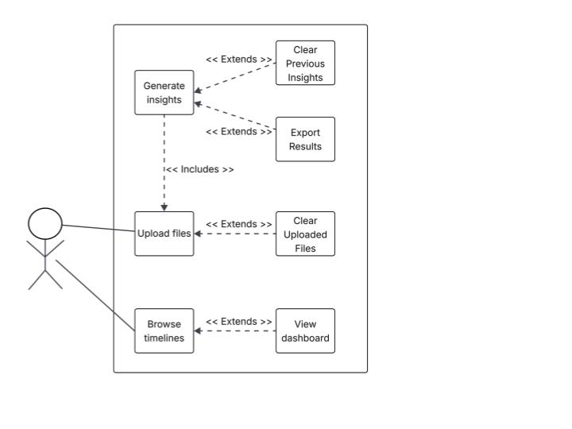

# Features Proposal for Mining Digital Work Artifacts  

**Team Number: 12**  

Team Members:  

- Sithara Chari 22066401
- Devin Huang 86828886
- Lexi Loudiadis 93546844
- Sara Srinivasan 10801751
- An Tran 79499364
- Madelyn DeGruchy 85064962

## Project Scope and Usage Scenario

This system will allow graduating students, or other professionals who regularly use a computer for their work, to be able to track their personal progress as well as generate meaningful insights to be used in a portfolio or resume. These users will be able to upload files in a safe manner that will ensure any personally identifiable information has been removed. The system will then create a dashboard for the user to help detail insights from their work, including languages, frameworks, and libraries they’ve used, as well as resume-oriented breakdowns of previous projects.

## Proposed Solution

Our solution is an intelligent app that extracts a bag of words from user-provided files, code repositories, and documents (with PII removed) and passes this data to an ML model to generate topic vectors that are processed by a Natural Language Generator to output resume-relevant skills while simultaneously producing analytical graphs and metadata visualizations. Unlike other teams, we will be using advanced NLP models like pyLDavis to analyze the users’ works and extract skills and qualifications that the user might otherwise overlook.  

## Use Cases  

Use Case 1: Generating Insights

- Primary actor: Graduate students or early professionals  
- Description: A user wishes to generate insights based on the files they uploaded. They click on the “Generate Insights” button, and sit back as the software generates a custom resume-ready portfolio for them.  
- Precondition:  
  - The user has uploaded all relevant files and preprocessing/classification has been completed  
  - The Bag of Words was successfully created and is ready for analysis by the NLP model  
- Postcondition:  
  - The system generates a text summary highlighting relevant skills and contributions in a resume-ready format  
  - These results are displayed to the user in an HTML page

Main Scenario:  

1. The user has already uploaded their files and is ready to see the results  
2. The user clicks the “Generate Insights” button.  
3. The system reviews the files and identifies patterns, topics, and skills  
4. The system renders the findings into insights about the user’s work  
5. The insights are prepared in a simple format that can be added to the user’s portfolio or resume  
6. The user views the insights in their web browser

- Extensions:  
  - 2a. No useful information is found: If the uploaded files do not contain enough useful content, the system tells the user that no insights could be generated.  
  - 3a. Insights unclear: If the system cannot recognize specific patterns in the data, it provides a more general output instead  
  - 4a. Display issue: if the insights cannot be shown in the normal resume-ready format, the system will show them to the user as plain text instead

Use Case 2:  A graduate student or early professional uploads their notes,papers and other academic text file.  

- Primary actor: Graduate students or early professionals  
- Description: The user wants to upload their notes, files and other academic data, so the system can analyze it and extract relevant skills and contributions, creating a summary that is ready to put on a resume.  
- Precondition:  
  - The user must have access to the web application  
  - The user has notes, codebases, papers and other academic text data in accepted formats. (txt, md, pdf, most code extensions, etc.)  
- Postcondition:  
  - The system generates a text summary highlighting relevant skills and contributions in a resume-ready format

Main Scenario:  

1. The user clicks the “upload” button.  
2. The user browses through their files and selects the research paper files  
3. The system validates the file format and content  
4. The system analyzes the paper  
5. The system generates a text summary that is resume-ready  
6. The user views the summary and has the option to save it

Extensions:  
2a. Invalid file format: The system notifies the user that invalid data was entered and repopulates the form with the data that the user previously tried to enter.  
4a. If the analysis fails (unreadable file), the system notifies the user of which file was unreadable and returns the user to the ‘upload files’ page

Use case 3: An individual clears uploaded files

- Primary actor: Graduate students or early professionals  
- Description: The user wants to remove previously uploaded files from the system.  
- Precondition:  
  - The user has access to the web application  
  - At least one file has already been uploaded  
- Postcondition:  
  - The selected files are removed from the system and no longer available for insight/analysis

Main Scenario:

1. The user navigates to the timeline section  
2. The user selects one or more files that they wish to remove from the system  
3. The user clicks on the “Delete selected file” button  
4. The system shows a popup asking for confirmation before deletion  
5. The user confirms the action  
6. The system removes the selected files  
7. The system updates the timeline to reflect the change

Extensions:  
2a. No files available: If no files were uploaded before, the system displays a message “No files to clear”  
4a. The user cancels: If the user cancels at the confirmation prompt, no files are deleted and the system stays in the current state.

Use case 4: An individual browses the timeline of previously generated insights

- Primary actor: Graduate students or early professionals  
- Description: The process of browsing the timeline of previously generated insights.  
- Precondition: The user must have access to the web app and have generated an insight previously.  
- Postcondition: The user can see the chronological timeline of previously generated insights.

Main Scenario:  

1. The user clicks on the “Timeline” button  
2. The system displays the timeline, divided by month, and each generated insight is represented by dots on the timeline  
3. The user can scroll through the timeline and hover over the dots to see additional details

Extensions:  
2a. If there is no previously generated dashboard, the system will display “No insights generated yet.” and the timeline will be empty

Use case 5: An individual views a previously generated dashboard

- Primary actor: Graduate students or early professionals  
- Description: The process of viewing a specific dashboard.  
- Precondition: The user must have access to the web app and have generated a dashboard previously.  
- Postcondition: The user can view full details of a specific previously generated dashboard

Main Scenario:  

1. User clicks on the “Timeline” button  
2. The system displays the timeline, divided by month, and each generated insight is represented by dots on the timeline  
3. User clicks on one of the dots on the timeline  
4. The system displays the selected dashboard

Extensions:  
2a. If there is no previously generated dashboard, the system will display “No dashboards generated yet.” and the timeline will be empty

Use case 6: An individual clears previously generated insights

- Primary actor: Graduate students or early professionals  
- Description: The process of removing an individual, some or all of the previously generated results from the system.  
- Precondition: The user must have previously uploaded file(s) and generated insights. The system needs to have successfully saved these results once they were generated.  
- Postcondition: All previous insights selected for deletion are removed from the database and they no longer appear on the timeline.

Main Scenario:

1. User clicks on the "Clear Previous Insights" button from the timeline or on the dashboard for the individual insight  
2. The User then selects the insights (grouped by the root directory selected by user for analysis) or can select to "Clear All"  
3. The user submits their selections  
4. The system shows a pop-up confirming the selected insights for removal  
5. The user confirms the action  
6. The system will remove the generated artifacts and insights from the database  
7. The system will update the timeline to remove the artifacts and insights  
8. The system notifies the user about the successful removal of the data

Extensions:  
1a. No insights available for export: The user will not be able to access the button to  
5a. The user cancels: if the user decides not to remove the insights they have selected when the system prompts them to confirm, then the system will not remove any data from the database

Use case 7: An individual exports generated insights

- Primary actor: Graduate students or early professionals  
- Description: The process of exporting the generated insights for use in resumes or a portfolio.  
- Precondition: The user must have uploaded file(s) and successfully generated insights.  
- Postcondition: The selected insights are exported in the requested format and saved to the user's specified location.

Main Scenario:

1. User clicks on the "Export Results" button, visible when viewing a specific generated insight  
2. User chooses the export format (CSV, DOCX, PDF)  
3. User specifies the name and location for the exported file  
4. The system formats the results as specified by the user, generates the export file and saves it to the specified location.  
5. The system notifies the user that the file was exported and saved successfully

Extensions:  
4a. File already exists at the location specified: System warns the user that a file of the same name already exists at that location and allows them to change the name, cancel the export, or replace the previous file  
2a/3a: The user cancels the export: If the user decides to cancel, then the system will not generate any export files

4.**Requirements, Testing, Requirement Verification**  

- Front-end:  
  - React, JavaScript, Jest (testing)  
- Back-end:  
  - Python and PyTest (testing)  
  - Packages: nltk \- for stemming and lemmatization, spacy \- for lemmatization, Pygments for code/variable extraction and processing, pyLDAvis \- LDA-driven ML-NLP model for topic analysis, pyClustering \- for clustering exported topic data from NLP, pyLDAvis.gensim \- for visualizations in html, pickle \- for html export to front end

# Milestone 1:

| Functional Requirement  | Description  | Test Cases  | Who  | H/M/Ea |
| :---- | :---- | :---- | :---- | ----- |
| Data Access Consent | The system shall prompt the user for consent to access local files The system shall allow the user to decline consent and exit gracefully. The system shall store consent decisions.  The system shall allow the user to update their decision. | Test Case 1: User gives consent to access files → system proceeds Test Case 2: User declines consent to access files → system exits gracefully Test Case 3: User begins process to access files → system prompts user for consent before files are accessed Test Case 4: User gives consent to access files → System stores this decision Test Case 5: User declines consent to access files → System stores this decision  Test Case 6: User updates their consent decision → system saves their new decision and proceeds appropriately  Test Case 7: User enters invalid response (not Y or N) → system prompts for response again |  | Easy |
| External Service Permissions | The system shall prompt the user for consent to use external services before processing any data. The system shall display the relevant implications for data privacy when using the external service.  The system shall provide an alternate analysis method should the user decline permission to use the external service.  The system shall store consent decisions. The system shall allow the user to update their decisions. | Test Case 1: User gives consent to use the external service → system proceeds to analyze using the external service Test Case 2: User declines consent to use the external service → system proceeds to analyze using the local methods Test Case 3: User begins process to analyze files → system prompts user for consent and displays potential data security implications Test Case 4: User gives consent to use external services → System stores this decision Test Case 5: User declines consent to use external services → System stores this decision  Test Case 6: User updates their consent decision → system saves their new decision and proceeds appropriately  |  | Medium |
| User Configuration Storage | The system shall save the user’s consent to access files. The system shall save the user’s consent to access external services. The system shall store the user configurations for future use. The system shall load the user’s previous configurations at startup. The system shall allow the user to update their configurations. The system shall store these file paths and the directory structure information for future use.  | Test Case 1: User gives consent to access files → system proceeds Test Case 2: User declines consent to access files → system exits gracefully Test Case 3: User gives consent to use external services → system proceeds to analyze using the external service Test Case 4: User declines consent to use external services → system proceeds to analyze using local methods Test Case 5: User responds to consent prompt to access files → system saves this decision Test Case 6: User responds to consent prompt to use external service → system saves this decision  Test Case 7: User updates their consent decision → system saves their new decision and proceeds appropriately  |  | Easy |
| File Input | The system shall allow users to provide a file path to a directory.  The system shall be able to access the user’s local files.  The system shall be able to parse through zipped folders of nested folders and files. The system shall accept file paths through a command line prompt. The system shall identify all files and subfolders within the nested structure. The system shall store these file paths and the directory structure information for future use.  The system shall validate the file type being accessed before proceeding.  The system shall handle files that are not compatible gracefully. | Test Case 1:  Filepath leads to a single file of a supported type → system parses the structure correctly Test Case 2: Filepath leads to a folder of multiple files of the same supported format → system parses the structure correctly Test Case 3: Multiple file upload of various types Filepath leads to a folder with multiple files of different supported formats → system parses the structure correctly Test Case 4: Filepath leads to a folder with nested folders → the system correctly parses through all folders and subfolders Test Case 5: The filepath leads to an empty folder → the system returns to the filepath input and provides a warning to the user that no usable content was parsed. Test Case 6: The filepath leads to a zipped folder → the system extracts the contents and parses through correctly Test Case 7: The filepath leads to a single file of a supported type → the system correctly stores the directory structure Test Case 8: The filepath leads to a folder with multiple files → the system correctly stores the directory structure Test Case 9: Filepath leads to a single file of an unsupported type → the system returns to the filepath input gracefully and provides error message to the user of the file and file type that were not supported.  Test Case 10: File size limit enforced (\>4GB) → the system returns to the filepath input gracefully and provides error message to user that the combined file size exceeds the system limit. Test case 11: Filepath leads to a folder where only one of the files is of an unsupported type → the system parses all other files correctly before gracefully returning to the filepath input with a warning to the user of the unsupported file Test case 12: Filepath leads to a folder with multiple files of unsupported types → the system correctly parses the files it can before returning to the filepath input and provides a warning to the user with all of the unsupported files | Sithara | Easy |
| File Classification  | The system shall identify code files to be sent to code pre-processing. The system shall identify text files to be sent to text pre-processing. The system shall identify files that do not conform to these standards and handle the file gracefully. | Test Case 1: A Python file is accessed → system classifies it as a code file. Test Case 2: A Java file is accessed → system classifies it as a code file. Test Case 3: A Word document is accessed → system classifies it as a text document. Test Case 4: A .txt file that contains code written in C is accessed → the system classifies it as a text document.  |  | Medium |
| Text File Pre-Processing | The system shall identify files that do not use the supported language (English) and handle them gracefully.  The system shall tokenize the text files and extract meaningful words from them. The system shall put the cleaned token list through a lemmatization process to group variant forms of the same word. The system shall remove any personally identifiable information (PII) from the lematized list of words to produce a Bag of Words (BoW). The system shall send the BoW to the BoW cache to begin text analysis. | Test Case 1: A text file containing the sentence “The cats were running faster than the dogs.”is to be preprocessed →  token list \[“The”, “cats”, “were”, “running”, “faster”, “than”, “the”, “dogs”\] Test Case 2: A token list \["The", "cats", "were", "running", "faster", "than", "the", "dogs"\] is to be cleaned up → \["cats", "running", "faster", "dogs"\] Test Case 3: A token list  \["cats", "running", "faster", "dogs"\] is to be lemmatized → \["cat", "run", "fast", "dog"\] Test Case 4: A text file containing PII “Bobby Brown 12345678” → PII remover process removes that from the final BoW. Test Case 5: A text file containing PII “123-456-789” → PII remover process identifies the format as PII and removes that from the final BoW. Test Case 6: A text file containing a full address → PII remover process identifies the format as PII and removes that from the final BoW. Test Case 7: A text file containing contact information (phone number, email) → PII remover process identifies the format as PII and removes that from the final BoW. Test Case 8: A text file written in Mandarin is detected → system will return to filepath input and provide error message that non-supported languages cannot be analyzed Test Case 9: An empty text file → the system gracefully proceeds without considering the file Test Case 10: A text file containing emojis, symbols, or numbers in text form (one, two, etc.) → system will not consider them while extracting tokens | An | Medium |
| Code File Pre-Processing | The system shall extract identifiers from a code file, including the names of functions, classes, variables, constants, and labels. The system shall utilize the Pygments library to complete this extraction of the identifier list.  The system shall tokenize the identifier list created from a code file. The system shall pass the code token list to the stopword removal process for the system to proceed | Test Case 1: A Python file is provided → extracts specified identifiers including functions, classes, and variable names Test Case 2: Identifier list is provided → the system successfully tokenizes the list Test Case 3: A Java file is provided → extracts methods, classes, and constant names. Test Case 4: An empty identifier list is provided → the system gracefully proceeds without considering the file |  | Hard |
| Code File Language Identification  | The system shall analyze file extensions to identify languages. The system shall keep track of the number of files per language. The system shall keep track of the number of lines written per language. The system shall determine the primary languages used by the user based on the number of lines of code written. The system shall support the detection of Python, Javascript, Java, C, C++, Rust, HTML, CSS, PHP | Test Case 1: A .py file is provided→ the system identifies it as Python Test Case 2: A .js file is provided → the system identifies it as JavaScript Test Case 3: A .java file is provided → the system identifies it as Java Test Case 4: A .c file is provided → the system identifies it as C Test Case 5: A .h file associated with a C project is provided → the system identifies it as C Test Case 6: A .h file associated with a C++ project is provided → the system identifies it as C++ Test Case 7: A .cpp file is provided → the system identifies it as C++ Test Case 8: 2 files containing 10 lines of Python code and 5 lines of Java code are provided → the system determines Python to be primary Test case 9: A . Js file is provided → the system identifies it as JavaScript (case insensitive) Test Case 10: A .rs file is provided → system identifies it as Rust Test Case 11: A .htm file is provided → system identifies it as HTML Test Case 12: A .css file is provided → system identifies it as CSS Test Case 13: A .php file is provided → system identifies it as PHP  |  | Medium |
| Text File Analysis | The system shall store the Bag of Words (BoW) from the text preprocessor into the BoW cache. The system shall analyze the BoW and identify main topics and topic(s) shared between the text file(s) using a Machine Learning model. The system shall assign a score for each topic to each text file and produce a topic vector for the text files. The system shall send each file’s topic vector to the statistics and data cache. | Test Case 1: BoW for one text file includes 4 instances of “machine learning” and 1 instance of “data analysis” → system shall assign this file a topic vector of 0.8 for machine learning and 0.2 for data analysis. Test Case 2: Multiple text files are being analyzed and several have “machine learning” as a common topic → system identifies the files that share the “machine learning” topic Test Case 3: BoW is empty → system shall return a null topic vector Test Case 4: A text file with a single word “the’ → system outputs topic vector null Test Case 5: A text file with a single word “cat” → system outputs topic vector with just “cat” |  | Hard |
| Metadata Analysis | The system shall extract general metadata from provided files, including file name and extension, filepath, file type, file size, file modification date/time, file creation date/time, mime type, encoding, checksum. The system shall extract file-type-specific metadata, such as line count for code files and author and word count for text files. The system shall replace missing/null metadata fields with general placeholder values. The system shall keep track of the metadata analyses for metadata statistics for insight generation and database storage. // Since invalid file types are handled in file input before metadata analysis, it will not be considered in metadata analysis. | Test Case 1: A file named “Assignment1.docx” → system will extract metadata such as Filepath Filename: “Assignment1” File extension: .docx File type: docx Mime type: application/vnd.openxmlformats-officedocument.wordprocessingml.document Author: Bobby Brown File size: 1.2MB Last modified date: 05/11/2025 Creation date: 12/19/2022 Word count: 3917 Encoding: UTF-8 Test Case 2: A file named “[a1.py](http://a1.py)” →  Filepath Filename: “a1” File extension: .py File type: Python Mime type: text/x-python File size: 833KB Last modified date: 01/28/2025 Creation date: 09/24/2022 Line count: 40 Encoding: UTF-8 Test Case 3: A file named “notes.txt” where author and creation date fields are missing → Filepath Filename: “notes” File extension: .txt File type: text Mime type: text/plain File size: 3.8MB Last modified date: 01/28/2025 Creation date: unknown\_date Author: unknown\_author Encoding: UTF-8 Word count: 3981 Test Case 4: Empty file named “empty.txt” → Filepath Filename: “empty” File extension: .txt File type: text Mime type: text/plain File size: 0 Last modified date: unknown\_date Creation date: unknown\_date Author: unknown\_author Encoding: UTF-8 Word count: 0 |  | Medium |
| Project Analysis | The system shall detect .git directories. The system shall be able to analyze the git commit history from multiple users. The system shall be able to classify a project as “individual” or “collaborative” based on the number of contributors. The system shall be able to determine which contributor is the user. The system shall analyze import statements to identify frameworks. The system shall support the detection of common Python frameworks such as Django, Flask, FastAPI, and PyTest. The system shall support the detection of common JavaScript frameworks such as Vue. The system shall support the detection of common Java frameworks such as Spring, Hibernate, JUnit and Mockito. The system shall consider the packages from the import lines of a code file. The system shall rank the importance of each project based on user contributions. | Test Case 1: A Python file containing ‘from django…’  → the system identifies the Django framework. Test Case 2: A JavaScript file containing ‘import vue …’ → the system identifies the Vue framework Test Case 3: A Java file containing ‘import org.springframework…’ → the system identifies the Spring framework Test Case 4: A directory contains a .git folder → the system proceeds to the .git reader Test Case 5: A directory contains a .git folder with a single contributor → the system identifies a single contributor Test Case 6: A directory contains a .git folder with multiple contributors → the system identifies the project as collaborative  Test Case 7: A directory contains a .git folder with multiple contributors → the system identifies the contributions made by the specific user  Test Case 8: 2 projects are provided, where the user has twice as many contributions in one compared to the other → the system ranks the project with higher contributions from the user as more important. |  | Hard |
| Clear Uploaded files | The system shall allow users to clear previously uploaded files from the system. The removal must delete the file and all associated artifacts. The timeline browser must reflect this deletion consistently. Complexity will arise from deleting certain files with many associated artifacts. The system shall notify the user after a file has been removed, and if there are no files to remove. | Test case 1: Delete a single file from the system Test Case 2: Delete multiple files from the system Test Case 3: Check if a confirmation prompt appears before the removal of files Test Case 4: Check if associated artifacts are also removed with the selected files Test case 5: No files to delete → error notification “There are no files to clear.” | Devin, Sara, Maddy | Medium |
| Clear previous insights | The system shall allow the user to remove the insights that were previously generated. This includes the ability to view a list of all insights generated to select 1 or multiple to clear, as well as a “clear all” option for the user to be able to start fresh. This will involve connecting with the database to allow for deletion and adequate user warnings to minimize accidental deletion. Potential difficulties may arise if the user is deleting a large amount of files simultaneously and how long the system will take to process that. The system shall notify the user after an insight or multiple have been removed, and if there are no insights to be removed. The system shall ensure content is not related to any other generated insights before removing it from the system. | Test Case 1: Remove a single insight Test Case 2: Remove Multiple, but not all insights Test Case 3: Remove all insights Test Case 4: No insights available for removal → error notification “There are no insights to clear.” Test Case 5: User cancels during the process Test Case 6: Remove insight that shares a file with other insights → other insight remains intact | Sara, Maddy, Devin | Easy |
| Generate Insights | The system shall generate insights, such as skills, topics, and contributions (portfolio information), from uploaded files. The system shall summarize the top-ranked projects for the user. The system shall use these insights to generate resume items, including summaries and top skills. The system shall receive a topic vector from the statistics and data cache The system shall transform the topic vector into readable insights The system shall notify the user if no insights can be generated from the uploaded files The system shall utilize the online LLM to generate insights from the topic vectors, given that online consent was provided by the user. The system shall utilize the Local NL Generator to generate insights from the topic vectors, given that online consent was not provided by the user. The system shall generate insights on contribution metrics from projects, including the duration and type of contributions (code, tests, designs, and documents)  | Test Case 1: Skills Extraction Input (topic vector): {python: 0.8, java: 0.6, sql: 0.4 Expected Output: \[“Python”, “Java”, “SQL”\] Assertion: Generated list equals expected skills Test Case 2: Synonym Matching Input: {js: 0.7, JavaScript: 0.5} Expected Output: \[“JavaScript”\] Assertion: Length of insights list \= 1; contains “JavaScript” Test Case 3: Empty Vector Input: {} Expected Output: “No insights available” message Test Case 4: Invalid Topic Vector Input: Topic vector with missing or corrupted values Expected output: Graceful error handling Assertion: No crash; error message displayed Test Case 5: Consent not given for LLM  Input (topic vector): {python: 0.8, java: 0.6, sql: 0.4 Expected insight generated: “You have strong skills in Python and Java, and experience in SQL.” Test Case 6: Consent given for LLM Input (topic vector): {python: 0.8, java: 0.6, sql: 0.4 Expected insight generated: “You are proficient in Python, with solid experience in Java and working knowledge of SQL.”  | Maddy, Devin, Sara SrinivasanSithara,An, Lexi(Pre- processing) | Medium |
| View Insights | The system shall produce a chronological list of projects. The system shall generate a chronological list of skills exercised. The system shall retrieve previously generated portfolio information. The system shall retrieve previously generated resume items. | Test Case 1: User requests a list of projects → chronological list of projects is returned Test Case 2: User requests a list of skills → chronological list of skills is returned Test Case 3: User requests a specific previously generated portfolio → system retrieves the requested portfolio data from the database and returns it to user Test Case 4: User requests specific previously generated resume items → system retrieves the requested resume items from the database and returns them to user |  | Medium |

| Non-functional Requirement | Description |
| :---- | :---- |
| Processing capacity and speed | The system shall process through 3GB of files within 120 seconds |
| RAM usage under normal use conditions | The system shall operate within 500mb of RAM under normal use conditions |
| RAM usage under peak conditions | The system shall use no more than 2GB of RAM under peak conditions |
| Categorization accuracy | The system shall categorize files with 98% accuracy |

# Milestone 2:

| Functional Requirement  | Description  | Test Cases  | Who  | H/M/Ea |
| :---- | :---- | :---- | :---- | ----- |
| Export results | The system shall export results in CSV, DOCX, and PDF formats with proper formatting. This will involve implementing a format converter, templates to organize insights within the artifact, and handling different data types across these formats. Complexity will come from exporting certain types of insights across files, such as how to handle graphs in CSV vs PDF.  | Test Case 1: Export as PDF  Test Case 2: Export as CSV Test Case 3: Export as DOCX Test Case 4: Export to a location where a file with the same name and file type already exists Test Case 5: Export to a location where a file with the same name and a different file type already exists Test Case 6: Export to an invalid location Test Case 7: User cancels the process before it is completed | An, Sithara, Lexi | Medium |

# Milestone 3:

# 

| Functional Requirement  | Description  | Test Cases  | Who  | H/M/Ea |
| :---- | :---- | :---- | :---- | ----- |
| View Dashboard | The system shall allow users to view the dashboard. The dashboard may contain pie charts and graphs that allow the user to see relevant topics and skills gathered from the uploaded files of that insight. The system shall display a button that will let the user export the dashboard. The system shall display a button for the user to navigate back to the timeline. The system shall display the insights to the user in an HTML format  | Test case 1: Navigate back to timeline Test case 2: Relevant info (graphs, summaries) is displayed in the dashboard Test case 3: If a dashboard was deleted in another tab, any tabs with that dashboard opened shall display an error notification (async) | An, Sithara, Lexi | Medium |
| Browse timeline | The system shall allow users to browse the timeline of previously generated insights. The timeline shall be sorted in chronological order and divided by month. Each generated insight shall be represented as an interactive dot on the timeline, and the user can hover over it to see basic information (time created, summary, number of files uploaded) or click on it to view the dashboard in full detail. The system shall display a button that allows the user to remove insights. If the user has not generated any insights, the timeline shall be empty and the system shall display the text “No insights generated yet.” | Test case 1: Multiple insights have already been generated → see insight dots on timeline Test case 2: No insight has been generated → empty timeline Test case 3: Insight dot being clicked on → navigate to view dashboard page Test case 4: Insight dot being hovered on → display info Test case 5: Not hovering on insight dot → make info disappear Test case 6: Cleared insight → not be displayed on the timeline | An, Sithara, Lexi | Medium |

### 
